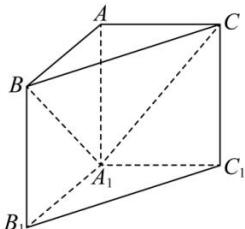

<!-- question-source:start -->
【17】如图, 直三棱柱 $ABC - A_{1}B_{1}C_{1}$ 中, $\angle BAC = 90^{\circ}$ , AB = AC = 1. 试在平面 $A_{1}BC$ 内确定一点 H, 使得 $AH \perp$ 平面 $A_{1}BC$ , 并写出证明过程.

<!-- question-source:end -->

![[Q00008912A1]]
