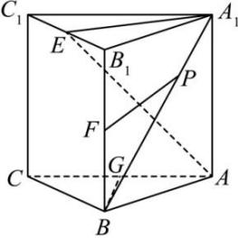

<!-- question-source:start -->
【18】如图,在直三棱柱 $ABC-A_{1}B_{1}C_{1}$ 中, $E,F,G$ 分别为线段 $B_{1}C_{1},B_{1}B$ 及 $AC$ 的中点, $P$ 为线段 $A_{1}B$ 上的点, $BG=\frac{1}{2}AC,AB=8,BC=6$ ,试确定动点 $P$ 的位置,使直线 $FP$ 与平面 $BB_{1}C_{1}C$ 互相垂直.

<!-- question-source:end -->

![[Q00008913A1]]
