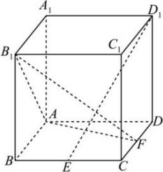

<!-- question-source:start -->
【19】如图,在棱长为1的正方体 $ABCD-A_{1}B_{1}C_{1}D_{1}$ 中,点 $E$ 是棱 $BC$ 的中点,点 $F$ 是棱 $CD$ 上的动点.试确定点 $F$ 的位置,使得 $D_{1}E\perp$ 平面 $AB_{1}F$ .

<!-- question-source:end -->

![[Q00008914A1]]
