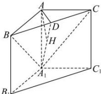

> [!faq]- 全练一本通解析
> **【答案】** 答案见解析
>
> **【解析】**
> 取棱 BC 的中点 D, 连接 $A_{1}D$ , AD. 在等腰直角 $\triangle ABC$ 中， $AD \perp BC$ 又 $AA_{1} \perp$ 平面 ABC， $BC \subset$ 平面 ABC，所以 $BC \perp AA_{1}$ ， $AD \cap AA_{1} = A, AD, AA_{1} \subset$ 平面 $ADA_{1}$ ，故 $BC \perp$ 平面 $ADA_{1}$ .
> 又 $BC \subset$ 平面 $A_{1}BC$ ，故平面 $A_{1}BC \perp$ 平面 $ADA_{1}$ ，这两个平面的交线为 $A_{1}D$ .
> 在 $\triangle ADA_{1}$ 中，作 $AH\perp A_{1}D$ ， $AH\subset$ 平面 $ADA_{1}$ 则有 $\mathrm{AH}\bot$ 平面 $A_{1}BC$ ；
> 
> $$
> A _ {1} B
> $$
> 【10】P 为中点的中点时
