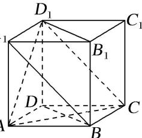

<!-- question-source:start -->
【26】（2022·全国高一课前预习）如图,在正方体 $ABCD-A_{1}B_{1}C_{1}D_{1}$ 中:

（1）AC 和 $DD_{1}$ 所成的角是 \_\_\_\_；
（2）AC 和 $D_{1}C_{1}$ 所成的角是 \_\_\_\_；
（3）AC 和 $B_{1}D_{1}$ 所成的角是 \_\_\_\_；
（4）AC 和 $A_{1}B$ 所成的角是 \_\_\_\_。
<!-- question-source:end -->

![[Q00005989A1]]
