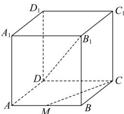

<!-- question-source:start -->
【32】(2024·山西晋中高二阶段练习)如图,在正方体 $ABCD-A_{1}B_{1}C_{1}D_{1}$ 中, M 是 AB 的中点, 则 $DB_{1}$ 与 CM 所成角的余弦值为（）

A. $\frac{\sqrt{30}}{10}$ B. $\frac{\sqrt{15}}{15}$ C. $\frac{3}{5}$ D. $\frac{\sqrt{6}}{3}$
<!-- question-source:end -->

![[Q00005995A1]]
