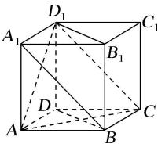

> [!faq]- 全练一本通解析
> **【答案】** $90^{\circ}$ 或 $\frac{\pi}{2}$ $45^{\circ}$ 或 $\frac{\pi}{4}$ $90^{\circ}$ 或 $\frac{\pi}{2}$ $60^{\circ}$ 或 $\frac{\pi}{3}$
>
> **【解析】**
> （1）根据正方体的性质可得 $DD \perp_{1}$ 平面 $ABCD \Rightarrow DD_{1} \perp AC$ ，所以 AC 和 $DD_{1}$ 所成的角是 $90^{\circ}$ .
> （2）∵ $D_{1}C_{1}//DC$ ，所以∠ACD即为AC和 $D_{1}C_{1}$ 所成的角，由正方体的性质得 $\angle ACD=45^{\circ}$ .
> （3）∵ $BD//B_{1}D_{1}, BD\perp AC, \therefore B_{1}D_{1}\perp AC,$ 即AC和 $B_{1}D_{1}$ 所成的角是
> 90°.
> （4）∵ $A_{1}B // D_{1}C, \triangle ACD_{1}$ 是等边三角形,所以AC和 $A_{1}B$ 所成的角是
> 60°.
> 故答案为: $90^{\circ}$ 或 $\frac{\pi}{2}$ ; $45^{\circ}$ 或 $\frac{\pi}{4}$ ; $90^{\circ}$ 或 $\frac{\pi}{2}$ ; $60^{\circ}$ 或 $\frac{\pi}{3}$ .
> 
