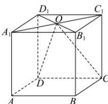

> [!faq]- 全练一本通解析
> **【答案】** A
>
> **【解析】**
> 解析: 因为 $AB \parallel CD$ ，所以异面直线 OC 与 AB 所成的角为 $\angle DCO$ 或其补角，
> 设正方体的棱长为 2，连接 OD，则 $OC = OD = \sqrt{2^{2} + (\sqrt{2})^{2}} = \sqrt{6}$ 在 $\triangle OCD$ 中， $\cos\angle DCO=\frac{\frac{CD}{2}}{OC}=\frac{1}{\sqrt{6}}=\frac{\sqrt{6}}{6}$ 即异面直线 OC 与 AB 所成角的余弦值为 $\frac{\sqrt{6}}{6}$ .
> 
