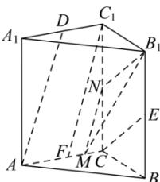

> [!faq]- 全练一本通解析
> **【答案】** A
>
> **【解析】**
> 解析:如图,取 AC 的中点为 F,FC 的中点为 M, $CC_{1}$ 的中点为 N,
> 连接 $C_{1}F, B_{1}N, MN, MB_{1}$ ，易知 $AD // C_{1}F, MN // C_{1}F$ 则 AD // MN，又 $CE // B_{1}N$ 所以 $\angle MNB_{1}$ 为异面直线 AD 与 CE 所成的角或其补角.
> 因为 $MN = \sqrt{1 + 9} = \sqrt{10}, B_{1}N = \sqrt{9 + 16} = 5, MB_{1} = \sqrt{1 + 16 + 36} = \sqrt{53}$ 所以 $\cos\angle MNB_{1}=\frac{25+10-53}{2\times5\times\sqrt{10}}=-\frac{18}{10\sqrt{10}}=-\frac{9\sqrt{10}}{50}$ 故异面直线 AD 与 CE 所成角的余弦值为 $\frac{9\sqrt{10}}{50}$ ，故选：A.
> 
