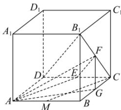

> [!faq]- 全练一本通解析
> **【答案】** B
>
> **【解析】**
> 解析:如下图,连接 $CB_{1}$ , 且 E,F,G 分别是 $CD,CB_{1},BC$ 中点, 连接 AE,EF,FG,AG,AF,
> 
> 由 M 是 AB 的中点, 则 $CM \parallel AE$ , 而 $EF \parallel DB_{1}$ ,
> 所以 $DB_{1}$ 与 CM 所成角, 即 AE, EF 所成角, 为 $\angle AEF$ 或其补角,
> 若正方体的棱长为 1, 则 $EF=\frac{1}{2}DB_{1}=\frac{\sqrt{3}}{2}, AF=\sqrt{FG^{2}+AG^{2}}=\frac{\sqrt{6}}{2}, AE=\sqrt{AD^{2}+DE^{2}}=\frac{\sqrt{5}}{2}$ $\triangle AEF$ 中， $\cos\angle AEF=\frac{EF^{2}+AE^{2}-AF^{2}}{2EF\cdot AE}=\frac{\frac{3}{4}+\frac{5}{4}-\frac{3}{2}}{2\times\frac{\sqrt{3}}{2}\times\frac{\sqrt{5}}{2}}=\frac{\sqrt{15}}{15}>0$ 所以直线 $DB_{1}$ 与 CM 所成角的余弦值为 $\frac{\sqrt{15}}{15}$ .
>
> 故选 **B**
