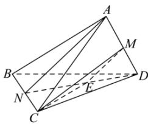

> [!faq]- 全练一本通解析
> **【答案】** C
>
> **【解析】**
> 解析: 连结 ND, 取 ND 的中点 E, 连结 ME、EC, 则 $ME \parallel AN$ , $\therefore \angle EMC$ 是异面直线 AN, CM 所成的角,
> 
> $\because AN = DN = \sqrt{3^2 - 1^2} = 2\sqrt{2}, \therefore ME = \frac{1}{2} AN = \sqrt{2}, EN = \frac{1}{2} DN = \sqrt{2},$ $MC = \sqrt{3^2 - 1^2} = 2\sqrt{2}$ 又 $\because EN \perp NC, \therefore EC = \sqrt{EN^2 + NC^2} = \sqrt{3},$ $\therefore \cos \angle EMC = \frac{EM^2 + MC^2 - EC^2}{2EM \times MC} = \frac{2 + 8 - 3}{2 \times \sqrt{2} \times 2\sqrt{2}} = \frac{7}{8},$ $\therefore$ 异面直线 $AN, CM$ 所成的角的余弦值为 $\frac{7}{8}$ .
>
> 故选 **C**
