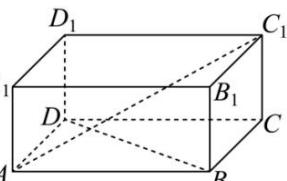

<!-- question-source:start -->
【37】（2024·陕西西安高三期末）如图，在长方体 $ABCD-A_{1}B_{1}C_{1}D_{1}$ 中，AB=8,AD=6，异面直线BD与 $AC_{1}$ 所成的的余弦值为 $\frac{\sqrt{7}}{10}$ ，则 $CC_{1}=()$

A. $\sqrt{3}$ B. $2\sqrt{2}$ C. $2\sqrt{3}$ D. $3\sqrt{2}$
<!-- question-source:end -->

![[Q00006000A1]]
