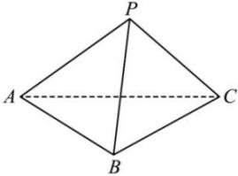

<!-- question-source:start -->
【42】已知P是等边三角形ABC所在平面外一点,PA=PB=PC= $\frac{2}{3}$ ,△ABC的边长为1,求PC和平面ABC所成的角的大小.</td></tr><tr><td>▷方法1:垂线法(直接法)</td></tr><tr><td>1.确定斜线与平面的交点(斜足);2.通过斜线上除斜足以外的某一点作平面的垂线,连接垂足和斜足即为斜线在平面上的射影,则斜线和射影所成的锐角即为所求的角;3.求解由斜线、垂线、射影构成的直角三角形.</td><td></td></tr><tr><td>
<!-- question-source:end -->

![[Q00006002A1]]
