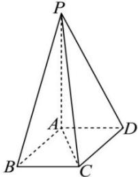
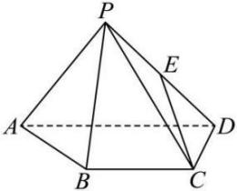

<!-- question-source:start -->
【45】如图,已知四棱锥P-ABCD,△PAD是以AD为斜边的等腰直角三角形,且满足BC//AD,PC=AD=2DC=2CB,CD⊥AD,E为PD的中点.求直线CE与平面PBC所成角的正弦值.</td></tr><tr><td></td><td></td></tr></table>

通过等体积法, 求出斜线在面外的一点到平面的距离, 再利用三角形的正弦公式进行求解.
<!-- question-source:end -->

![[Q00006008A1]]
