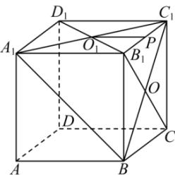

<!-- question-source:start -->
【50】(2024·全国高三专题练习)已知正方体 $AC_{1}$ 棱长为 $a, O_{1}$ 是正方体上底面的中心，P 是 $B_{1}C_{1}$ 的中点，求 $PO_{1}$ 与平面 $A_{1}BC_{1}$ 所成角的余弦值.

<!-- question-source:end -->

![[Q00006013A1]]
