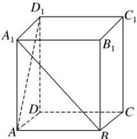

<!-- question-source:start -->
【38】（2023·全国高一课时练习）如图，在四棱柱 $ABCD-A_{1}B_{1}C_{1}D_{1}$ 中，侧面都是矩形，底面ABCD是菱形且 $AB=BC=2\sqrt{3}$ ， $\angle ABC=120^{\circ}$ ，若异面直线 $A_{1}B$ 和 $AD_{1}$ 所成的角为 $90^{\circ}$ ，试求 $AA_{1}$ .

<!-- question-source:end -->

![[Q00008919A1]]
