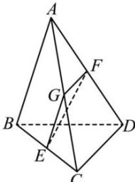

> [!faq]- 全练一本通解析
> **【答案】** D
>
> **【解析】**
> 解析:如图, 设 G 是 AC 的中点, 分别连接 EG, GF, 由已知得 $EG \parallel AB$ , $EG = \frac{1}{2} AB$ , $FG = \frac{1}{2} CD$ , $FG \parallel CD$ , 所以 $\angle EGF$ 是 AB, CD 所成的角或是其补角.
> 
> 因为 AB = CD，所以 EG = GF.
> 当 $\angle EGF = 30^{\circ}$ 时，AB 和 EF 所成角 $\angle GEF = 75^{\circ}$ ，
> 当 $\angle EGF = 150^{\circ}$ 时，AB 和 EF 所成角 $\angle GEF = 15^{\circ}$ .
>
> 故选 **D**
