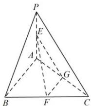

> [!faq]- 全练一本通解析
> **【答案】** $2\sqrt{2}$
>
> **【解析】**
> 取 AC 的中点 G，连接 EG, FG，
> 在三角形 PAC 中，E, G 分别为 PA, AC 的中点，所以
> EG // PC, EG = $\frac{1}{2}$ PC = 2,
> 同理 FG // AB, FG = $\frac{1}{2}$ AB = 2, 因为 PC ⊥ AB,
> 所以 EG ⊥ GF, 所以 $EF = \sqrt{2^{2} + 2^{2}} = 2\sqrt{2}$ . 故答案为： $2\sqrt{2}$ .
> 
