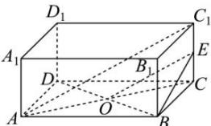

> [!faq]- 全练一本通解析
> **【答案】** C
>
> **【解析】**
> 解析: 连接 AC, 交 DB 于点 O, 取 $CC_{1}$ 的中点 E, 连接 OE, BE.
> 
> 因为 $AC_{1} // OE$ ，所以 BD 与 $AC_{1}$ 所成的角为 $\angle BOE$ （或其补角）.
> 令 EC = x，在 $\triangle BEO$ 中，由 AB = 8, AD = 6，得 OB = 5.
> 又 $OE = \sqrt{x^{2} + 25}, BE = \sqrt{x^{2} + 36}, \cos \angle BOE = \frac{\sqrt{7}}{10}$ 由余弦定理得 $\frac{OE^{2}+OB^{2}-BE^{2}}{2OE\cdot OB}=\frac{\sqrt{7}}{10}$ ，即 $\frac{x^{2}+25+25-x^{2}-36}{2\times5\times\sqrt{x^{2}+25}}=\frac{\sqrt{7}}{10}$ ，解得 $x=\sqrt{3}$ ，所以 $CC_{1}=2\sqrt{3}$ .
>
> 故选 **C**
