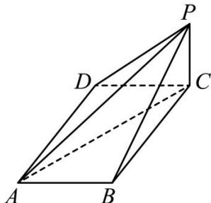

<!-- question-source:start -->
【47】（2023·陕西榆林高一下阶段练习）如图，四棱锥 P-ABCD 中， $PC \perp$ 平面 ABCD，PC=1，底面 ABCD 是矩形，且 $AB=\sqrt{2}$ ， $AD=\sqrt{3}$ ，求直线 AC 与平面 APD 所成的角的正弦值.

<!-- question-source:end -->

![[Q00006010A1]]
