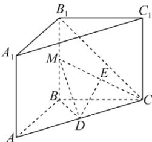

<!-- question-source:start -->
【48】(2022·吉林长春模拟)直三棱柱 $ABC-A_{1}B_{1}C_{1}$ 中， $AA_{1}B_{1}B$ 为正方形，AB=BC， $\angle ABC=120^{\circ}$ ，点 M、D、E 分别为 $BB_{1}$ ，AC，CM 的中点，求直线 $B_{1}C$ 和平面 CDM 所成角的正弦值.

第六节 空间直线与平面的垂直
<!-- question-source:end -->

![[Q00006011A1]]
