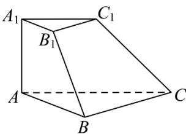

<!-- question-source:start -->
【49】如图, 在三棱台 $ABC-A_{1}B_{1}C_{1}$ 中, $AA_{1}\perp$ 平面 ABC, $\angle ABC=90^{\circ}$ , $AA_{1}=A_{1}B_{1}=B_{1}C_{1}=1$ , AB=2, 求 AC 与平面 $BCC_{1}B_{1}$ 所成角正弦值.

<!-- question-source:end -->

![[Q00006012A1]]
