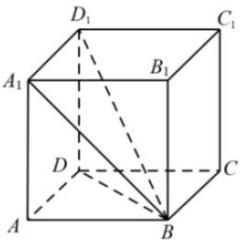

<!-- question-source:start -->
【39】(2023·全国高一课时练习)如图,已知正方体 $ABCD-A_{1}B_{1}C_{1}D_{1}$ 的棱长为2.(1)求直线 $A_{1}B$ 和平面ABCD所成角的大小;(2)求直线 $BD_{1}$ 和平面ABCD所成角的正切值.

<!-- question-source:end -->

![[Q00008920A1]]
