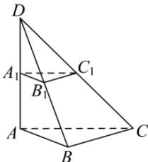

> [!faq]- 全练一本通解析
> **【答案】** $\sin \theta = \frac{1}{2}$
>
> **【解析】**
> 将棱台补全为如下棱锥 D-ABC,
> 
> 由 $\angle ABC = 90^{\circ}$ ， $AA_{1} = A_{1}B_{1} = B_{1}C_{1} = 1$ ， $AB = 2$ ，易知 $DA = AB = BC = 2$ ， $AC = 2\sqrt{2}$ ，
> 由 $AA_{1}\bot$ 平面 $ABC$ ， $AB,AC,BC\subset$ 平面 $ABC$ ，则 $AA_{1}\bot AB$ ， $AA_{1}\bot AC$ ， $AA_{1}\bot BC$ ，
> 所以 $BD = 2\sqrt{2}$ ， $CD = 2\sqrt{3}$ .
> 可得 $S_{\triangle BCD} = \frac{1}{2}\times 2\times 2\sqrt{2} = 2\sqrt{2}$ ，
> 设 $A$ 到平面 $BCC_1B_1$ 的距离为 $h$ ，又 $V_{D - ABC} = V_{A - BCD}$ ，
> 则 $\frac{1}{3}\times 2\times \frac{1}{2}\times 2\times 2 = \frac{1}{3} h\times 2\sqrt{2}$ ，可得 $h = \sqrt{2}$ ，
> 设 $AC$ 与平面 $BCC_1B_1$ 所成角为 $\theta$ ， $\theta \in \left[0,\frac{\pi}{2}\right]$ ，则 $\sin \theta = \frac{h}{AC} = \frac{1}{2}$
