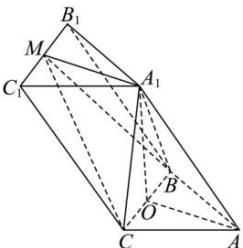

> [!faq]- 全练一本通解析
> **【答案】** （1） $\frac{2\sqrt{14}}{3}$ （2） $\frac{\sqrt{14}}{6}$
>
> **【解析】**
> （1）取 BC 的中点 O，连接 OA， $OA_{1}$ ，
> 因为 $A_{1}$ 在底面 ABC 上的射影为 O，
> 所以 $OA_{1} \perp$ 面 ABC，
> 在三棱柱 $ABC-A_{1}B_{1}C_{1}$ 中，面 $ABC \parallel$ 面 $A_{1}B_{1}C_{1}$ ，
> 所以 $OA_{1} \perp$ 面 $A_{1}B_{1}C_{1}$ . 因为 $MA_{1} \subset$ 面 $A_{1}B_{1}C_{1}$ ，
> 所以 $OA_{1} \perp MA_{1}$ 在 $\triangle A_{1}B_{1}C_{1}$ 中，M 为线段 $B_{1}C_{1}$ 的中点， $B_{1}C_{1} \perp MA_{1}$ 因为 $BC \parallel B_{1}C_{1}$ 所以 $BC \perp MA_{1}$ 因为 $OA_{1} \subset$ 面 $A_{1}BC, BC \subset$ 面 $A_{1}BC, OA_{1} \cap BC = O$ 所以 $MA_{1} \perp$ 面 $A_{1}BC$ $\triangle ABC$ 中，AB = AC = 2， $\angle BAC = 90^{\circ}$ ，所以 $BC = 2\sqrt{2}, OA = \sqrt{2}$ 所以 $V_{M-A_{1}BC}=\frac{1}{3}S_{\triangle A_{1}BC}\cdot MA_{1}=\frac{1}{3}\times\frac{1}{2}BC\cdot OA_{1}\cdot MA_{1}=\frac{1}{3}\times\frac{1}{2}BC\cdot\sqrt{AA_{1}^{2}-OA^{2}}\cdot MA_{1}=$ $=\frac{1}{3}\times\frac{1}{2}\times2\sqrt{2}\cdot\sqrt{16-2}\cdot\sqrt{2}=\frac{2\sqrt{14}}{3};$
> 
> （2）设 C 到平面 $MA_{1}B$ 的距离为 d，则
> 在 $Rt\triangle MA_{1}B$ 中， $MA_{1}=\sqrt{2}$ ， $A_{1}C=A_{1}B=\sqrt{OA_{1}^{2}+OB^{2}}=\sqrt{14+2}=4$ ，
> 所以 $S_{\triangle MA_{1}B}=\frac{1}{2}MA_{1}\cdot A_{1}B=\frac{1}{2}\times\sqrt{2}\times4=2\sqrt{2}$ 所以 $d=\frac{3V_{M-A_{1}BC}}{S_{\triangle MA_{1}B}}=\sqrt{7}$ 设 MC 与平面 $MA_{1}B$ 所成角为 $\theta$ ，则 $\sin\theta=\frac{d}{MC}=\frac{d}{\sqrt{MA_{1}^{2}+A_{1}C^{2}}}=\frac{\sqrt{7}}{\sqrt{2+16}}=\frac{\sqrt{14}}{6}$ 所以 MC 与平面 $MA_{1}B$ 所成角的正弦值为 $\frac{\sqrt{14}}{6}$ .
