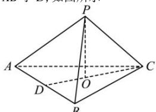

> [!faq]- 全练一本通解析
> **【答案】** $\frac{\pi}{6}$
>
> **【解析】**
> 因为 $\triangle ABC$ 为等边三角形, 且 PA = PB = PC, 所以三棱锥 P-ABC 为正棱锥,
> 过 P 作 PO 垂直底面 ABC, 则 O 为 $\triangle ABC$ 的中心, 连接 CO, 并延长, 交 AB 于 D, 如图所示
> 
> 因为 $PO \perp$ 平面 $ABC$ , 所以 $\angle PCO$ 即为 $PC$ 和平面 $ABC$ 所成的角, 因为 $AB = 1$ , 所以 $CD = \sqrt{BC^2 - BD^2} = \frac{\sqrt{3}}{2}$ , 所以 $CO = \frac{2}{3} \times CD = \frac{\sqrt{3}}{3}$ , 在 $Rt \triangle PCO$ 中, $\cos \angle PCO = \frac{CO}{PC} = \frac{\sqrt{3}}{2}$ , 所以 $\angle PCO = \frac{\pi}{6}$ , 即 $PC$ 和平面 $ABC$ 所成的角为 $\frac{\pi}{6}$ .
