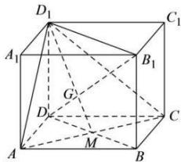

> [!faq]- 全练一本通解析
> **【答案】** $\frac{\sqrt{3}}{3}$
>
> **【解析】**
> 取 $AC$ 的中点 $M$ , 连接 $D_1M$ , 与 $DB_1$ 交于点 $G$ . 因为 $AC \perp$ 平面 $BB_1D_1D$ , $B_1G \subset$ 平面 $BB_1D_1D$ , 则 $AC \perp B_1G$ . 通过垂直判定定理可证 $CD_1 \perp$ 平面 $B_1C_1D$ 所以 $CD_1 \perp B_1G$ , $AC \cap CD_1 = C$ , $AC, CD_1 \subset$ 平面 $ACD_1$ ,
> $\therefore B_{1}G \perp$ 平面 $ACD_{1}$ , 又 $D_{1}G \subset$ 平面 $ACD_{1}$ , 则 $B_{1}G \perp D_{1}G$ , 直线 $B_{1}D_{1}$ 在平面 $ACD_{1}$ 的射影为直线 $D_{1}G$ , $\therefore \angle B_{1}D_{1}G$ 就是直线 $B_{1}D_{1}$ 和平面 $ACD_{1}$ 所成的角. 由正方体性质知 $B_{1}ACD_{1}$ 是正四面体, $G$ 是 $\triangle ACD_{1}$ 的重心, $AC = B_{1}D_{1} = 2\sqrt{2}$ . $D_{1}G = \frac{2}{3} D_{1}M = \frac{2}{3} \times \frac{\sqrt{3}}{2} AC = \frac{2\sqrt{6}}{3}$ , $\sin \angle B_{1}D_{1}G = \frac{\frac{2\sqrt{6}}{3}}{2\sqrt{2}} = \frac{\sqrt{3}}{3}$ , 直线 $B_{1}D_{1}$ 和平面 $ACD_{1}$ 所成角的正弦值为 $\frac{\sqrt{3}}{3}$ .
> 
