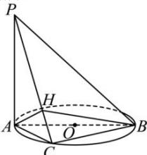

> [!faq]- 全练一本通解析
> **【答案】** $\frac{\sqrt{3}}{3}$
>
> **【解析】**
> 解: 过 A 作 $AH \perp PC$ 于 H,
> 
> ∵ AB 是 $\odot O$ 的直径, C 是圆周上不同于 A, B 的一动点, ∴ $BC \perp AC$ ,
> ∵ PA⊥平面 ABC, BC⊂平面 ABC, ∴ PA⊥BC.
> 又 PA∩AC = A, PA, AC⊂平面 PAC,
> ∴ BC⊥平面 PAC
> ∴ BC⊥AH,
> 又 PC∩BC=C, PC, BC⊂平面 PBC, ∴ AH⊥平面 PBC,
> ∴ ∠ABH 是直线 AB 与平面 PBC 所成的角,
> 在 Rt△PAC 中, $AH=\frac{PA\cdot AC}{\sqrt{PA^{2}+AC^{2}}}=\frac{\sqrt{6}}{3}AC$ ,
> 在 Rt△ABH 中， $\sin\angle ABH=\frac{AH}{AB}=\frac{\frac{\sqrt{6}}{3}AC}{\sqrt{2}AC}=\frac{\sqrt{3}}{3}$ 故直线 AB 与平面 PBC 所成角的正弦值为 $\frac{\sqrt{3}}{3}$ .
