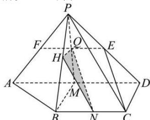

> [!faq]- 全练一本通解析
> **【答案】** $\frac{\sqrt{2}}{8}$
>
> **【解析】**
> 如图,设PA的中点为F,分别取AD,BC的中点M,N,连接PM,交EF于点Q,连接NQ.
> 因为E,F,N分别是PD,PA,BC的中点,所以Q为EF的中点.
> 因为QE= $\frac{1}{2}$ MD,NC= $\frac{1}{2}$ MD,QE//MD,NC//MD,所以QE//NC,且QE=NC,
> 故四边形NCEQ为平行四边形,所以NQ//CE.
> 由 $\triangle PAD$ 为等腰直角三角形得PM⊥AD.
> 由DC⊥AD,M是AD的中点可知四边形BCDM为正方形,所以BM⊥AD,
> 又BM∩PM=M,BM,PM⊂平面PBM,
> 所以AD⊥平面PBM.
> 
> 由 $BC \parallel AD$ 得 $BC \perp$ 平面 $PBM$ ，
> 又 $BC \subset$ 平面 $PBC$ , 所以平面 $PBC \perp$ 平面 $PBM$ .
> 过点 $Q$ 作 $PB$ 的垂线, 垂足为 $H$ ,
> 因为平面 $PBC \perp$ 平面 $PBM$ , 平面 $PBC \cap$ 平面 $PBM = PB$ , $QH \subset$ 平面 $PBM$ , 所以 $QH \perp$ 平面 $PBC$ ,
> 连接 $NH.NH$ 是 $NQ$ 在平面 $PBC$ 上的射影,
> 所以 $\angle QNH$ 是直线 $CE$ 与平面 $PBC$ 所成的角.
> 设 $CD = 1$ , 在 $\triangle PCD$ 中,
> 由 $PC = 2, CD = 1, PD = \sqrt{2}$ 得 $\frac{1 + 2 - 4}{2 \times 1 \times \sqrt{2}} = \frac{1 + \frac{1}{2} - CE^2}{2 \times 1 \times \frac{\sqrt{2}}{2}}$ , 故 $CE = \sqrt{2}$ .
> 在 $\triangle PBM$ 中, 由 $PM = BM = 1, PB = \sqrt{3}$ 得 $QH = \frac{1}{4}$ .
> 在 Rt $\triangle NQH$ 中, $\sin \angle QNH = \frac{\sqrt{2}}{8}$ ,
> 所以直线 $CE$ 与平面 $PBC$ 所成角的正弦值是 $\frac{\sqrt{2}}{8}$ .
