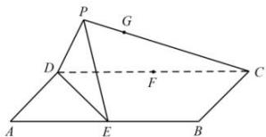

<!-- question-source:start -->
【4】已知矩形 ABCD, AB = 4, BC = 2, E、F 分别为边 AB、CD 的中点. 沿直线 DE 将 $\Delta ADE$ 翻折成 $\Delta PDE$ ，在点 P 从 A 至 F 的运动过程中，CP 的中点 G 的轨迹长度为 \_\_\_\_.

<!-- question-source:end -->

![[Q00006168A1]]
