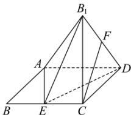

<!-- question-source:start -->
【5】（2024·四川内江高二期中）如图，已知菱形ABCD中， $AB=2,\angle BAD=120^{\circ}$ ，E为边BC的中点，将 $\triangle ABE$ 沿AE翻折成 $\triangle AB_{1}E$ （点 $B_{1}$ 位于平面ABCD上方），连接 $B_{1}C$ 和 $B_{1}D$ ，F为 $B_{1}D$ 的中点，则在翻折过程中，点F的轨迹的长度为\_\_\_\_。

<!-- question-source:end -->

![[Q00006169A1]]
