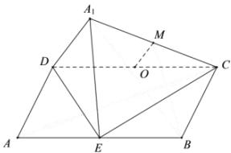

> [!faq]- 全练一本通解析
> **【答案】** D
>
> **【解析】**
> 解析: 取 DC 中点 O, 连接 OM, 由于 M 为线段 $A_{1}C$ 的中点, 所以 $OM \parallel A_{1}D, OM = \frac{1}{2}A_{1}D = \frac{1}{2}$ , 所以 M 在以点 O 为圆心的圆弧上的一部分, 故 D 选项正确. 故选: D
> 
