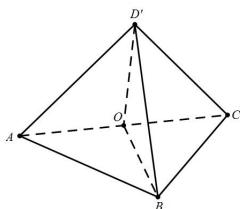

> [!faq]- 全练一本通解析
> **【答案】** C
>
> **【解析】**
> 解析: 设方形 ABCD 对角线 AC 与 BD 交于 O, 由题意, 翻折后当 $BD'$ 的最小值为 $\sqrt{2}$ 时, $\triangle OD'B$ 为边长为 $\sqrt{2}$ 的等边三角形, 此时 $\angle D'OB = \frac{\pi}{3}$ , 所以点 D 的运动轨迹是以 O 为圆心 $\sqrt{2}$ 为半径的圆心角为 $\frac{2\pi}{3}$ 的圆弧, 所以点 D 的运动轨迹的长度为 $\frac{2\pi}{3} \times \sqrt{2} = \frac{2\sqrt{2}\pi}{3}$ , 故选项 C 正确.
> 
