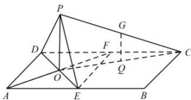

> [!faq]- 全练一本通解析
> **【答案】** $\frac{\sqrt{2}\pi}{2}$
>
> **【解析】**
> 设 AF 与 DE 相交于 O, 由于在矩形 ABCD 中, E, F 分别是 AB, CD 的中点, 且 AE = EF = FD = DA, 所以四边形 AEFD 是正方形. 沿直线 DE 将 $\Delta ADE$ 翻折成 $\Delta PDE$ , 在点 P 从 A 至 F 的运动过程中, $OP = OA = \frac{1}{2} \cdot AF = \frac{1}{2} \times 2\sqrt{2} = \sqrt{2}$ 不变, 故 P 点的轨迹是以 O 为圆心, 半径为 $\sqrt{2}$ 的半圆. 设 Q 是 OC 的中点, 由于 G 是 CP 的中点, 所以 QG是三角形 OPC 的中位线, 所以 $GQ // OP$ , $QG = \frac{1}{2}OP = \frac{\sqrt{2}}{2}$ . 由于在翻折过程中, O, C 两点的位置不变, 所以 Q 点的位置不变, 所以 G 点的轨迹是以 Q 为圆心, 半径为 $\frac{\sqrt{2}}{2}$ 的半圆. 所以 G 的轨迹长度为 $\pi \cdot \frac{\sqrt{2}}{2} = \frac{\sqrt{2}\pi}{2}$ . 故答案为: $\frac{\sqrt{2}\pi}{2}$
> 
> $$
> \begin{array}{c} \frac {\pi}{2} \end{array}
> $$
