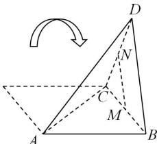

<!-- question-source:start -->
【6】M, N 分别为菱形 ABCD 的边 BC, CD 的中点, 将菱形沿对角线 AC 折起, 使点 D 不在平面 ABC 内, 则在翻折过程中, 对于下列两个命题: ① 直线 MN 恒与平面 ABD 平行; ② 异面直线 AC 与 MN 恒垂直. 以下判断正确的是（）

A. ①为真命题, ②为真命题
B. ①为真命题, ②为假命题
C. ①为假命题, ②为真命题
D. ①为假命题, ②为假命题
<!-- question-source:end -->

![[Q00006170A1]]
