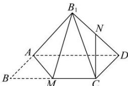

<!-- question-source:start -->
【8】如图, 矩形 ABCD 中, AD = 2AB = 2, M 为边 BC 的中点, 将 $\triangle ABM$ 沿直线 AM 翻折成 $\triangle AB_{1}M$ , 若 N 为线段 $B_{1}D$ 的中点, 则在 $\triangle ABM$ 翻折过程中, 下面说法中正确的序号是（）

① CN 是定值
② 存在某个位置, 使 $AM \perp B_{1}D$ ③ 存在某个位置, 使 $CN \perp AB_{1}$ ④ $B_{1}$ 不在底面 ADC 上时, 则 CN// 平面 $AB_{1}M$ A. ①② B. ①④ C. ①③ D. ②④
<!-- question-source:end -->

![[Q00006172A1]]
