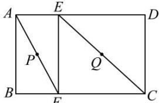

<!-- question-source:start -->
【13】（2024·全国高二专题）如图, 在矩形 ABCD 中, E、F 分别为边 AD、BC 上的点, 且 AD = 3AE, BC = 3BF, 设 P、Q 分别为线段 AF、CE 的中点, 将四边形 ABFE 沿着直线 EF 进行翻折, 使得点 A 不在平面 CDEF 上, 在这一过程中, 下列关系不能成立的是（）

A. 直线 $AB \parallel$ 直线 $CD$ B. 直线 $AB \perp$ 直线 $PQ$ C. 直线 $PQ \parallel$ 直线 $ED$ D. 直线 $PQ \parallel$ 平面 $ADE$
<!-- question-source:end -->

![[Q00006177A1]]
