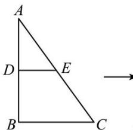
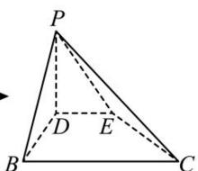

<!-- question-source:start -->
【14】（2023·四川内江高二练习）已知 Rt△ABC 中，∠ABC = 90°，AB = 12，BC = 8，D、E 分别是 AB、AC 中点，将 △ADE 沿直线 DE 翻折至 △DPE，形成四棱锥 P-BCED，在翻折过程中，下列结论可能成立的为（）

A. $\angle DPE = \angle BPC$ B. $PD\bot EC$ C. $PE\bot BC$ D.平面PDE⊥平面PBC
<!-- question-source:end -->

![[Q00006178A1]]
