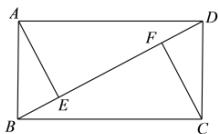
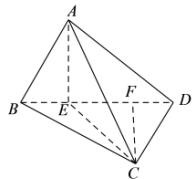

> [!faq]- 全练一本通解析
> **【答案】** B
>
> **【解析】**
> 解析:矩形在翻折前和翻折后的图形如图（1）、图（2）所示.
> 
> (1)
> 
> (2)
> 在图（1）中，过点 $A$ 作 $AE \perp BD$ ，垂足为 $E$ ，过点 $C$ 作 $CF \perp BD$ ，垂足为 $F$ 由边 $AB, BC$ 不相等可知点 $E, F$ 不重合.
> 在图（2）中，连接 $CE$ 对于选项A, 若 $AC \perp BD$ ，又知 $BD \perp AE$ ， $AE \cap AC = A$ ，所以 $BD \perp$ 平面 $ACE$ 所以 $BD \perp CE$ ，与点 $E, F$ 不重合相矛盾，故选项A错误；
> 对于选项B, 若 $AB \perp CD$ ，又知 $AB \perp AD$ ， $AD \cap CD = D$ ，所以 $AB \perp$ 平面 $ADC$ ，所以 $AB \perp AC$ ，由 $AB < BC$ 可知，存在这样的等腰直角三角形，使得直线 $AB$ 与直线 $CD$ 垂直，故选项B正确；
> 对于选项C, 若 $AD \perp BC$ ，又知 $DC \perp BC$ ， $AD \cap DC = D$ 所以 $BC \perp$ 平面 $ADC$ ，所以 $BC \perp AC$ 已知 $AB = 2$ ， $BC = 2\sqrt{2}$ ，则 $BC > AB$ ，所以不存在这样的直角三角形，故选项C错误；由以上可知选项D错误.
>
> 故选 **B**.
