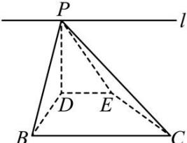

> [!faq]- 全练一本通解析
> **【答案】** B
>
> **【解析】**
> 【详解】对于 A 选项, 翻折前, 易知 $\tan \angle DAE = \frac{BC}{AB} = \frac{8}{12} = \frac{2}{3}$ , 因为 $D$ 、 $E$ 分别是 $AB$ 、 $AC$ 的中点, 则 $DE // BC$ , 因为 $AB \perp BC$ , 则 $DE \perp AB$ , 即 $DE \perp AD$ , $DE \perp BD$ , 翻折后, 则 $DE \perp PD$ , $DE \perp BD$ , $PD \cap BD = D$ , $PD$ 、 $BD \subset$ 平面 $PBD$ , 所以, $DE \perp$ 平面 $PBD$ , 因为 $DE // BC$ , 所以, $BC \perp$ 平面 $PBD$ , 因为 $PB \subset$ 平面 $PBD$ , 则 $BC \perp PB$ , 因为 $PB < PD + DB = 12$ , 所以, $\tan \angle BPC = \frac{BC}{PB} = \frac{8}{PB} > \frac{2}{3} = \tan \angle DPE$ , 故 $\angle DPE \neq \angle BPC$ , A 错; 对于 B 选项, 当 $PD \perp BD$ 时, 因为 $DE \perp PD$ , 且 $DE \cap BD = D$ , $DE$ 、 $BD \subset$ 平面 $BCED$ , 所以, $PD \perp$ 平面 $BCED$ , 因为 $EC \subset$ 平面 $BCED$ , 所以, $PD \perp EC$ , B 对; 对于 C 选项, 因为 $DE \perp PD$ , 则 $\triangle PDE$ 为直角三角形, 且 $\angle PED$ 为锐角, 因为 $BC // DE$ , 则 $BC$ 与 $PE$ 所成角为 $\angle PED$ , 故 $BC$ 与 $PE$ 不可能垂直, C 错; 对于 D 选项, 因为 $DE // BC$ , $DE \not\subset$ 平面 $PBC$ , $BC \subset$ 平面 $PBC$ , 则 $DE //$ 平面 $PBC$ , 设平面 $PDE \cap$ 平面 $PBC = l$ , 又因为 $DE \subset$ 平面 $PDE$ , 所以, $l // DE$ ,
> 
> 因为 $DE \perp$ 平面 $PBD$ , 则 $l \perp$ 平面 $PBD$ ,
> $$
> P B \text {、} P D \subset
> $$
> $$
> P B D
> $$
> $$
> l \perp P D, l \perp P B
> $$
> 所以, 平面 PDE 与平面 PBC 所成二面角的平面角为 $\angle BPD$ ,
> 若平面 $PDE \perp$ 平面 PBC，则 $\angle BPD$ 为直角，从而可知 BD 为 $\triangle PBD$ 的最长边，
> 这与 BD = PD 矛盾, 假设不成立, 故平面 PBC 与平面 PDE 不可能垂直, D 错.
>
> 故选 **B**.
