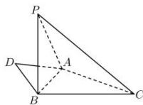

<!-- question-source:start -->
【19】(2023·黑龙江高二)如图,平面四边形ACBD中, $\angle ABC=90^{\circ}$ , $\angle ABD=\angle BAD=30^{\circ}$ , $AB=\sqrt{3}$ ,BC=2,将 $\triangle ABD$ 沿AB翻折,使点D移动至点P,且 $PB\perp BC$ ,则三棱锥P-ABC外接球体积为()

A. $8\pi$ B. $6\pi$ C. $4\pi$ D. $\frac{8\sqrt{2}}{3}\pi$
<!-- question-source:end -->

![[Q00006183A1]]
