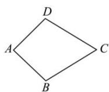
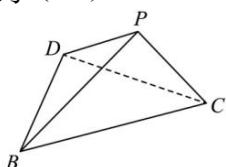

<!-- question-source:start -->
【22】如图1,在四边形ABCD中， $AB = AD = \sqrt{2}$ ， $CB = CD = 2$ ， $AB \perp AD$ ，将△ABD沿BD翻折至△PBD，使二面角P-BD-C的正切值等于 $\sqrt{2}$ ，如图2,四面体PBCD的四个顶点都在同一个球面上，则该球的表面积为（）

图1
图2

A. $4\pi$ B. $6\pi$ C. $8\pi$ D. $9\pi$
<!-- question-source:end -->

![[Q00006186A1]]
