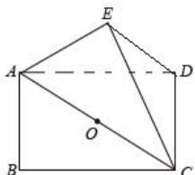

> [!faq]- 全练一本通解析
> **【答案】** D
>
> **【解析】**
> 解析: 设 AC 的中点为 O, 因为 ABCD 是矩形, 所以 $\triangle BAC$ 、 $\triangle DAC$ 是共斜边的直角三角形,
> $$
> O A = O C = O B = O D = \frac {1}{2} A C = \frac {1}{2} \sqrt {A B ^ {2} + B C ^ {2}} = \frac {1}{2} \sqrt {3 6 + 6 4} = 5
> $$
> $$
> \frac {4 \pi}{3} \cdot 5 ^ {3} = \frac {5 0 0}{3} \pi
> $$
> 
