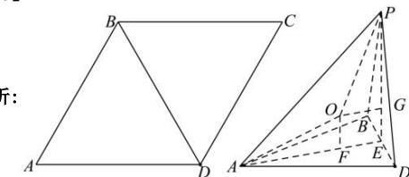

> [!faq]- 全练一本通解析
> **【答案】** D
>
> **【解析】**
> 解析：
> 
> 依题意, 三棱锥 P-ABD 中, PB=PD=AB=AD=BD=6, 平面 ABD⊥平面 PBD,
> 取 $BD$ 中点 $E$ , 连接 $AE, PE$ . 则 $AE = PE = 3\sqrt{3}$ .
> $$
> P E \perp B D
> $$
> $$
> A B D \cap
> $$
> $$
> P B D = B D, P E \subset
> $$
> $$
> P B D
> $$
> $$
> P E \perp
> $$
> $$
> A B D
> $$
> $$
> A E \perp
> $$
> $$
> F 、 G
> $$
> $$
> \text {为} \triangle A B D 、 \triangle P B D
> $$
> $$
> F E = G E = \sqrt {3}
> $$
> $$
> \mathrm{心}
> $$
> $$
> O \text {为三棱}
> $$
> $$
> P - A B D
> $$
> $$
> O A 、 O P 、 O F 、 O G
> $$
> $$
> \mathrm{心}
> $$
> $$
> O F \perp
> $$
> $$
> A B D, O G \perp
> $$
> $$
> P B D
> $$
> $$
> O G \parallel A E
> $$
> $$
> O F \parallel P E
> $$
> $$
> O F E G
> $$
> $$
> O F = G E = \sqrt {3}, A F = 2 \sqrt {3}
> $$
> 则 $R^2 = AF^2 +OF^2 = (2\sqrt{3})^2 +(\sqrt{3})^2 = 15$
> 因此三棱锥 P-ABD 的外接球的表面积为 $4\pi R^{2}=60\pi$ .
>
> 故选 **D**.
