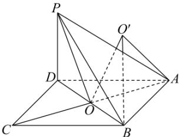

> [!faq]- 全练一本通解析
> **【答案】** D
>
> **【解析】**
> 解析: 连接 BD, AC 交于 O, 连接 PO, 易得 O 为 BD 与 AC 的中点,
> 
> ∵ 四边形 ABCD 为菱形，∴ $AC \perp BD$ ，即 $AO \perp BD$ ， $PO \perp BD$ ，
> ∴ 二面角 A-BD-P 的平面角为 $\angle AOP$ ，∴ $\angle AOP = 120^{\circ}$ ；
> 又 AB = AD = 6, $\angle BAD = 60^{\circ}$ , 所以 $AO = PO = 3\sqrt{3}, BD = 6$ ,
> 在 $\triangle AOP$ 中, 由余弦定理得 $PA=\sqrt{AO^{2}+PO^{2}-2AO\cdot PO\cdot\cos\angle AOP}=9$ 由三棱锥 P-ABD 的结构特征可得其外接球的球心在 $\angle AOP$ 的平分线上，
> 记外接球的球心为 $O'$ ，设 $OO' = x$ ，外接球半径为 r，
> 所以 $x^{2} + OB^{2} = r^{2} = x^{2} + AO^{2} - 2x \cdot AO \cos 60^{\circ}$ 即 $3^{2}=(3\sqrt{3})^{2}-2x\times3\sqrt{3}\times\frac{1}{2}$ ，解得 $x=2\sqrt{3}$ ，所以 $r^{2}=12+9=21$ ，
> 三棱锥 P-ABD 的外接球的表面积为 $4\pi r^{2}=84\pi$ .
>
> 故选 **D**.
