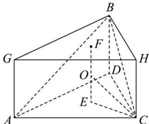

> [!faq]- 全练一本通解析
> **【答案】** C
>
> **【解析】**
> 解析:由题意 $CD \perp BD$ , $AD \perp BD$ , ∴二面角 A-BD-C 的平面角是 $\angle ADC$ , ∴ $\angle ADC = \frac{\pi}{3}$ , 又 AD = DC = 1,
> ∴△ACD 是边长为 1 的正三角形, $BD \perp$ 平面 ACD, 将三棱锥 B-ACD 补形成正三棱柱,
> 三棱锥的外接球球心就是正三棱柱的外接球球心,
> 取△ACD 外接圆的圆心 E, △BGH 外接圆的圆心 F,
> 根据对称性知正三棱柱的外接球球心 O 是 EF 的中点,
> ∵ $BD = \frac{1}{2} \sqrt{\left(\sqrt{2}\right)^{2} + \left(\sqrt{2}\right)^{2}} = 1$ , ∴ $EO = \frac{1}{2}$ ,
> 又△ACD 是边长为 1 的正三角形, 点 E 是其外
> 心, ∴ $EC = \frac{2}{3} \sqrt{1^{2} - \left(\frac{1}{2}\right)^{2}} = \frac{\sqrt{3}}{3}$ ,
> 在 Rt△OEC 中， $OC=\sqrt{OE^{2}+EC^{2}}=\sqrt{\left(\frac{1}{2}\right)^{2}+\left(\frac{\sqrt{3}}{3}\right)^{2}}=\frac{\sqrt{21}}{6}$ 即 $R=\frac{\sqrt{21}}{6}$ ，∴三棱锥 C-ABD 的外接球的表面积为 $S=4\pi R^{2}=4\pi\times\frac{7}{12}=\frac{7}{3}\pi$ . 故选：C.
> 
