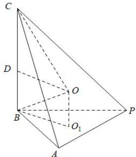

> [!faq]- 全练一本通解析
> **【答案】** D
>
> **【解析】**
> 解析: 因为 $\angle ABC = 90^{\circ}$ ，所以 $AB \perp BC$ ，
> 因为 $PB \perp BC, PB \perp AB = B$ ，所以， $BC \perp$ 平面 PAB，
> 如图，设 $\triangle PAB$ 外接圆的圆心为 $O_{1}$ ，三棱锥 P-ABC 外接球球心为 O，
> 连接 $OO_{1}, BO_{1}$ ，过 O 作 $OD \perp BC$ ，垂足为 D，则 $OD = O_{1}B$ 所以，在 $\triangle PAB$ 中， $\angle ABP = \angle BAP = 30^{\circ}$ ， $\angle APB = 120^{\circ}$ ， $AB = \sqrt{3}$ ，
> 所以， $\triangle PAB$ 外接圆的直径为 $\frac{AB}{\sin\angle APB}=2$ ，即半径为1， $BO_{1}=1$ ，
> 设三棱锥 P-ABC 外接球的半径为 R， $OO_{1}=h$ ，则 CD=2-h，
> 所以， $\triangle OO_{1}B$ 中， $OB^{2}=O_{1}B^{2}+O_{1}O^{2}$ ，即 $R^{2}=1+h^{2}$ 在 $\triangle OCD$ 中， $CO^{2}=CD^{2}+OD^{2}$ ，即 $R^{2}=1+(2-h)^{2}$ 所以， $R^{2}=1+\left(2-h\right)^{2}=1+h^{2}$ ，解得 h=1， $R=\sqrt{2}$
> 所以, 三棱锥 P-ABC 的外接球的体积为 $V=\frac{4}{3}\pi R^{3}=\frac{8\sqrt{2}}{3}\pi$ . 故选: D
> B
> 
