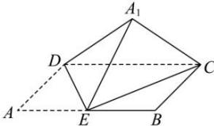

<!-- question-source:start -->
【25】如图, 在矩形 ABCD 中, AB=2AD=2a, E 是 AB 的中点, 将 $\triangle ADE$ 沿 DE 翻折至 $\triangle A_{1}DE$ 的位置, 使三棱锥 $A_{1}-CDE$ 的体积取得最大值, 若此时三棱锥 $A_{1}-CDE$ 外接球的表面积为 $16\pi$ , 则 a=（）

A. 2 B. $\sqrt{2}$ C. $2\sqrt{2}$ D. 4
<!-- question-source:end -->

![[Q00006189A1]]
