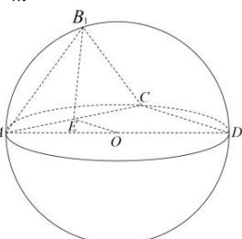

> [!faq]- 全练一本通解析
> **【答案】** $4\pi$
>
> **【解析】**
> A
> 
> ∵△ACD面积为定值，故当 $B_{1}$ 到平面ACD距离最大时，三棱锥 $B_{1} - ACD$ 体积最大，即当平面 $B_{1}AC\bot$ 平面 $ACD$ 时，三棱锥 $B_{1} - ACD$ 的体积最大，记 $AD$ 中点为 $O$ ， $AC$ 中点为 $E$ 易知 $AC = CD = \sqrt{2}$ ， $AC\bot CD$ ， $AB_{1} = CB_{1} = 1$ ， $AB_{1}\bot CB_{1}$ 易知 $EO\bot$ 平面 $B_{1}AC$ ， $B_{1}E\bot$ 平面 $ACD$ 可求 $OB_{1} = \sqrt{\frac{1}{2} + \frac{1}{2}} = 1 = OA = OC = OD = 1$ 故 $O$ 为三棱椎 $B_{1} - ACD$ 的外接球的球心，且球的半径为 $R = 1$ 故外接球表面积为 $4\pi R^2 = 4\pi$ .故答案为： $4\pi$
