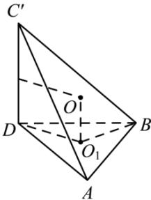

> [!faq]- 全练一本通解析
> **【答案】** C
>
> **【解析】**
> C解析：因为底面 $A^{\prime}BD$ 为正三角形，所以底面 $A^{\prime}BD$ 面积为定值，所以当 $C^{\prime}BD\bot$ 平面 $A^{\prime}BD$ 时，四面体ABCD的体积最大.设△A'BD外接圆圆心为 $O_{1}$ ，则四面体ABCD的外接球的球心 $O$ 满足 $OO_{1}//C^{\prime}D$ ，且 $OO_{1} = \frac{1}{2} C^{\prime}D = \frac{3}{2}$ ，三角形 $A^{\prime}BD$ 的外接圆半径为 $2r = \frac{3}{\sin60^{\circ}}\Rightarrow r = \sqrt{3}$ ，因此外接球的半径 $R$ 满足
> $$
> R ^ {2} = \left(\frac {3}{2}\right) ^ {2} + (r) ^ {2} = \left(\frac {3}{2}\right) ^ {2} + (\sqrt {3}) ^ {2} = \frac {2 1}{4}
> $$
> 从而外接球的表面积为 $4\pi R^2 = 21\pi$ .故选：C.
> 
